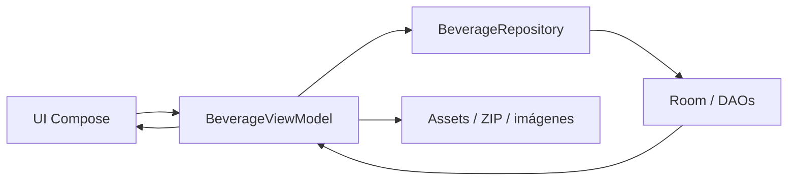
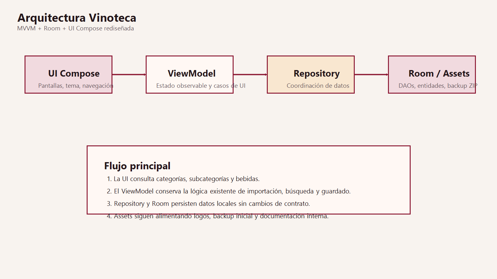

# Arquitectura de Vinoteca

## Resumen
Vinoteca mantiene una arquitectura MVVM sencilla y estable. El rediseño realizado afecta solo a la capa visual en Jetpack Compose, sin modificar contratos de datos, persistencia, repositorios, DAOs ni flujos de negocio.

La app sigue apoyándose en:

- `UI Compose` para presentación y navegación.
- `BeverageViewModel` como orquestador de estado observable.
- `BeverageRepository` como puerta de acceso a datos.
- `Room` para persistencia local.
- `assets` para logos, backup inicial y documentación interna.

## Capas actuales
- `ui/` contiene las pantallas Compose, el sistema visual y la navegación.
- `viewmodel/` expone estado observable y operaciones sobre bebidas, categorías, subcategorías y backups.
- `data/` contiene Room, DAOs y repositorio.
- `model/` define entidades de dominio persistidas.

## Patrón MVVM
- La UI lee `categories`, `subcategories`, `selectedBeverage` y `beverages` desde `BeverageViewModel`.
- La UI emite eventos de intención: guardar, borrar, filtrar, importar, exportar, navegar.
- El ViewModel delega en `BeverageRepository`.
- El repositorio usa DAOs Room y acceso a archivos locales para imágenes y ZIPs.

## Persistencia con Room
- `AppDatabase.kt` inicializa la base local.
- `BeverageDao.kt`, `CategoryDao.kt` y `SubCategoryDao.kt` encapsulan operaciones SQL.
- `BeverageRepository.kt` coordina lecturas y escrituras sin que la UI conozca detalles de almacenamiento.

## Flujo de datos

## Navegación y composición
- `MainActivity.kt` crea el `ViewModel`, activa `edge-to-edge` y monta `AplicacionVinoteca`.
- `NavHost` sigue teniendo cuatro destinos funcionales:
  - Pantalla principal.
  - Alta y edición de bebida.
  - Gestión de categorías.
  - Gestión de subcategorías.

## Decisiones del rediseño
- La marca y la paleta se centralizan en `ui/tema/MarcaVinoteca.kt`.
- El tema Compose vive en `ui/tema/TemaVinoteca.kt`.
- El launcher icon se actualiza con `res/drawable/ic_launcher_vinoteca.xml`.
- El logo seleccionado para identidad visual es `app/src/main/assets/logos/logo_vinoteca1.png`.

## Impacto del rediseño en arquitectura
- No cambia el modelo de datos.
- No cambia la estrategia de persistencia.
- No cambia el contrato del ViewModel.
- No cambia la lógica de importación/exportación.
- Sí cambia la organización de la capa UI para separar:
  - `ui/principal/`
  - `ui/agregar_editar_bebida/`
  - `ui/categoria/`
  - `ui/tema/`
