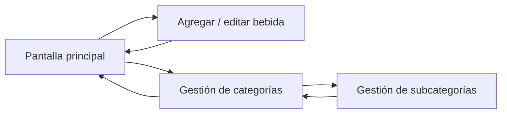
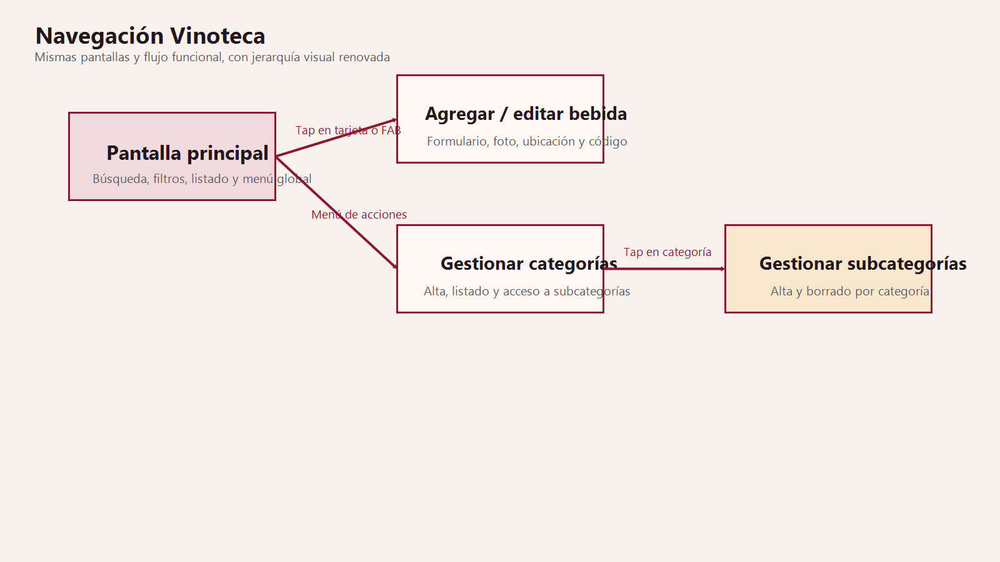

# Navegación de Vinoteca

## Rutas activas
- `pantalla_principal`
- `pantalla_agregar_editar?beverageId={beverageId}`
- `pantalla_gestion_categorias`
- `pantalla_gestion_subcategorias/{categoryId}/{categoryName}`

## Flujo funcional
- La app abre siempre en la pantalla principal.
- Desde la home se puede:
  - buscar y filtrar bebidas
  - abrir una bebida para editarla
  - crear una bebida nueva
  - abrir gestión de categorías
  - importar o exportar CSV/ZIP
- Desde gestión de categorías se entra al detalle de subcategorías por categoría.
- Desde cualquier pantalla secundaria se vuelve con navegación hacia atrás.

## Diagrama Mermaid

## Detalle de cada pantalla
### Pantalla principal
- Función: exploración del inventario.
- Estado consumido: `categories`, `subcategories`, `beverages`.
- Eventos: navegar, buscar, filtrar, abrir menú global, previsualizar imagen.

### Agregar / editar bebida
- Función: alta, edición y borrado de una referencia.
- Estado consumido: `selectedBeverage`, `categories`, `subcategories`.
- Eventos: guardar, eliminar, abrir cámara, abrir galería, escanear código.

### Gestión de categorías
- Función: crear y borrar categorías; acceder a subcategorías.
- Estado consumido: `categories`.
- Eventos: alta, borrado, navegación a subcategorías.

### Gestión de subcategorías
- Función: crear y borrar subcategorías ligadas a una categoría.
- Estado consumido: `subcategories`.
- Eventos: carga por `categoryId`, alta, borrado.
