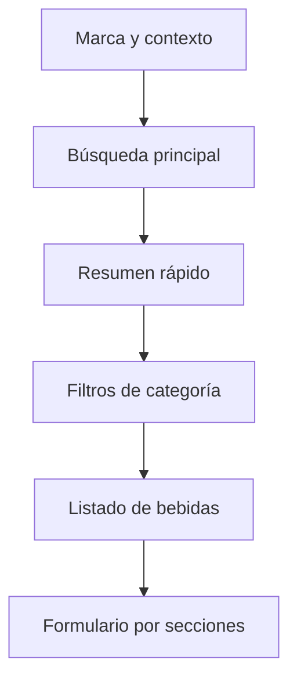
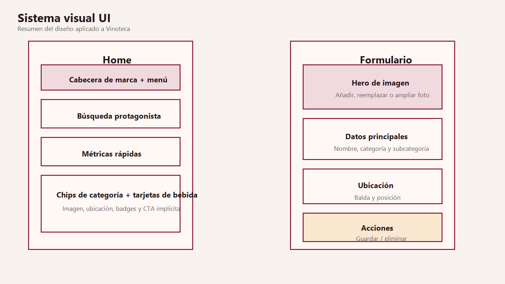

# Sistema de UI de Vinoteca

## Objetivo visual
El rediseño busca un punto medio entre limpieza profesional y riqueza visual. La interfaz sigue siendo operativa y rápida, pero ahora usa mejor la jerarquía, la marca y los patrones de Material 3.

## Dirección de diseño
- Identidad inspirada en `logo_vinoteca1.png`.
- Paleta vino/granate con fondos crema y acentos dorados.
- Tarjetas elevadas, formas redondeadas y espaciado amplio.
- Tipografía con mezcla de `Serif` en titulares y `SansSerif` en zonas operativas.
- Color dinámico compatible con Android 12+, reforzado con colores de marca.

## Componentes principales
- `CabeceraPrincipal`: bloque de marca con logo, claim y menú global.
- `CampoBusquedaInventario`: buscador protagonista dentro de una superficie elevada.
- `TarjetaResumen`: métricas rápidas del estado del inventario.
- `FilterChip` y `AssistChip`: reemplazan las pestañas por filtros más táctiles.
- `TarjetaBebida`: imagen, ubicación, categoría, subcategoría y código de barras en una sola pieza escaneable.
- `TarjetaHeroImagen`: hero visual para la foto de la bebida en alta/edición.
- `TarjetaSeccionFormulario`: agrupa campos del formulario por propósito.

## Colores
- Primario: `#8B1732`
- Primario oscuro: `#551020`
- Rubor suave: `#D18698`
- Crema base: `#F8F3EF`
- Marfil: `#FFFBF8`
- Dorado acento: `#C48A3A`

## Tipografía
- `displaySmall`: titulares editoriales de marca.
- `headlineMedium`: bloques secundarios importantes.
- `titleLarge` y `titleMedium`: encabezados operativos.
- `bodyLarge` y `bodyMedium`: lectura principal y supporting text.
- `labelLarge`: botones, chips y acciones.

## Shapes
- `small`: `18.dp`
- `medium`: `24.dp`
- `large`: `32.dp`

## Jerarquía visual

## Pantallas rediseñadas
- Pantalla principal:
  - cabecera editorial
  - búsqueda prominente
  - métricas rápidas
  - filtros por chips
  - tarjetas de producto enriquecidas
- Alta y edición:
  - hero de imagen
  - bloque de datos principales
  - bloque de ubicación
  - bloque de identificación
  - bloque de acciones
- Gestión:
  - tarjetas introductorias
  - formularios elevados
  - listas con affordance de navegación

## Accesibilidad y usabilidad
- Mejora del tamaño de targets táctiles.
- Contraste reforzado entre texto, fondos y estados.
- Textos guía más claros en estados vacíos.
- Mejor descubribilidad de acciones principales.
- Uso de `contentDescription` en iconos y logo cuando aporta valor semántico.
